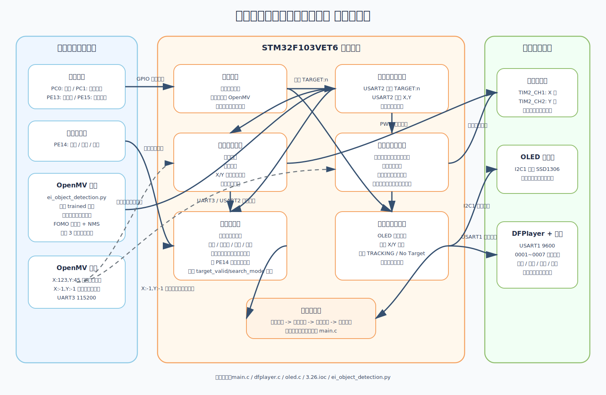

# 系统功能与模块关系说明



## 1. 项目总体定位

本项目是一个面向室内近距离视障辅助场景的嵌入式智能感知与引导系统。

整套系统的核心目标是：

- 用户通过按键选择当前要寻找的目标
- OpenMV 根据当前模式执行视觉识别
- STM32 根据识别结果控制双舵机云台跟踪或搜索
- OLED 显示当前模式与运行状态
- DFPlayer 播放语音提示，帮助用户理解系统状态

当前主控工程核心逻辑在 [main.c](C:/Users/ikun/Desktop/面向室内近距离视障辅助场景的嵌入式智能感知与引导系统设计与实现-黄彬/完整版本系统备份/备份1.0-4.1/stm32f103vet6逻辑代码实现/Core/Src/main.c)，OpenMV 端脚本在 [ei_object_detection.py](C:/Users/ikun/Desktop/面向室内近距离视障辅助场景的嵌入式智能感知与引导系统设计与实现-黄彬/完整版本系统备份/备份1.0-4.1/openmv运行脚本/ei_object_detection.py)。

## 2. 系统由哪些部分组成

### 2.1 STM32 主控部分

STM32 负责整套系统的主流程调度，主要完成：

- 按键扫描
- 模式管理
- 与 OpenMV 串口通信
- 云台舵机控制
- OLED 状态显示
- DFPlayer 语音播报控制

核心文件：

- [main.c](C:/Users/ikun/Desktop/面向室内近距离视障辅助场景的嵌入式智能感知与引导系统设计与实现-黄彬/完整版本系统备份/备份1.0-4.1/stm32f103vet6逻辑代码实现/Core/Src/main.c)
- [3.26.ioc](C:/Users/ikun/Desktop/面向室内近距离视障辅助场景的嵌入式智能感知与引导系统设计与实现-黄彬/完整版本系统备份/备份1.0-4.1/stm32f103vet6逻辑代码实现/3.26.ioc)

### 2.2 OpenMV 视觉识别部分

OpenMV 负责图像采集和目标识别，主要完成：

- 摄像头采集图像
- 加载训练好的模型 `trained`
- 只识别当前 STM32 指定的目标类别
- 对识别结果做后处理
- 将目标中心坐标通过串口发给 STM32

核心文件：

- [ei_object_detection.py](C:/Users/ikun/Desktop/面向室内近距离视障辅助场景的嵌入式智能感知与引导系统设计与实现-黄彬/完整版本系统备份/备份1.0-4.1/openmv运行脚本/ei_object_detection.py)

### 2.3 执行与交互部分

外设包括：

- 双舵机云台
- OLED 显示屏
- DFPlayer 语音模块
- 小喇叭
- 五个按键

这些模块都由 STM32 统一管理。

## 3. 当前已经实现的功能

### 3.1 目标模式选择

用户可以通过按键选择目标模式：

- `PC0`：厕所
- `PC1`：安全出口
- `PE13`：办公室
- `PE15`：停止识别
- `PE14`：语音测试

实现位置：

- [main.c](C:/Users/ikun/Desktop/面向室内近距离视障辅助场景的嵌入式智能感知与引导系统设计与实现-黄彬/完整版本系统备份/备份1.0-4.1/stm32f103vet6逻辑代码实现/Core/Src/main.c#L1228)

### 3.2 STM32 与 OpenMV 联动识别

STM32 会通过 `USART2` 把当前目标模式发给 OpenMV，命令格式为：

```text
TARGET:0
TARGET:1
TARGET:2
TARGET:3
```

OpenMV 收到后，只跟踪当前模式对应的类别。

STM32 发送位置：

- [main.c](C:/Users/ikun/Desktop/面向室内近距离视障辅助场景的嵌入式智能感知与引导系统设计与实现-黄彬/完整版本系统备份/备份1.0-4.1/stm32f103vet6逻辑代码实现/Core/Src/main.c#L1189)

OpenMV 接收位置：

- [ei_object_detection.py](C:/Users/ikun/Desktop/面向室内近距离视障辅助场景的嵌入式智能感知与引导系统设计与实现-黄彬/完整版本系统备份/备份1.0-4.1/openmv运行脚本/ei_object_detection.py)

### 3.3 OpenMV 目标检测

OpenMV 脚本当前使用的是 `FOMO` 风格的检测流程，主要逻辑是：

- `sensor.set_framesize(sensor.QVGA)`，分辨率为 `320x240`
- `model = ml.Model("trained")` 加载模型
- 通过 `fomo_post_process()` 对输出热力图做 `find_blobs + NMS`
- 只保留当前目标类别中置信度最高的一个检测框
- 通过检测框中心计算 `center_x` 和 `center_y`

脚本里当前的重要参数：

- `min_confidence = 0.4`
- `stable_detect_required = 3`

也就是说，OpenMV 不是一识别到就立刻给 STM32 发坐标，而是要连续稳定检测到 `3` 次，才真正发出目标中心坐标。

这部分实现位置：

- [ei_object_detection.py](C:/Users/ikun/Desktop/面向室内近距离视障辅助场景的嵌入式智能感知与引导系统设计与实现-黄彬/完整版本系统备份/备份1.0-4.1/openmv运行脚本/ei_object_detection.py)

### 3.4 OpenMV 向 STM32 返回结果

OpenMV 给 STM32 返回两种结果：

- 找到稳定目标：`X:123,Y:45`
- 没找到目标或尚未稳定：`X:-1,Y:-1`

这一步非常关键，因为它直接决定 STM32 是进入“跟踪”，还是进入“搜索/丢失处理”。

### 3.5 双舵机云台跟踪

当 STM32 收到有效目标坐标后，会：

- 对坐标做滤波
- 计算图像中心误差
- 将误差转换成 X/Y 舵机角度修正
- 平滑输出到舵机，避免动作突变

实现位置：

- [main.c](C:/Users/ikun/Desktop/面向室内近距离视障辅助场景的嵌入式智能感知与引导系统设计与实现-黄彬/完整版本系统备份/备份1.0-4.1/stm32f103vet6逻辑代码实现/Core/Src/main.c#L698)
- [main.c](C:/Users/ikun/Desktop/面向室内近距离视障辅助场景的嵌入式智能感知与引导系统设计与实现-黄彬/完整版本系统备份/备份1.0-4.1/stm32f103vet6逻辑代码实现/Core/Src/main.c#L820)
- [main.c](C:/Users/ikun/Desktop/面向室内近距离视障辅助场景的嵌入式智能感知与引导系统设计与实现-黄彬/完整版本系统备份/备份1.0-4.1/stm32f103vet6逻辑代码实现/Core/Src/main.c#L1761)

### 3.6 主动搜索目标

当当前目标没有被识别到时，STM32 会进入搜索模式：

- 切换目标后，会进入普通搜索流程
- 普通搜索是延时后执行左右往返扫描
- 如果目标是在稳定跟踪后真正丢失，则会进入“自适应主动重捕获”
- 主动重捕获分两阶段：
  - 先以最后一次有效位置为中心做小范围快速搜索
  - 若局部搜索超时仍未找回，再扩展为全范围搜索
- 这样可以优先利用最后观测信息，提高重捕获效率

实现位置：

- [main.c](C:/Users/ikun/Desktop/面向室内近距离视障辅助场景的嵌入式智能感知与引导系统设计与实现-黄彬/完整版本系统备份/备份1.0-4.1/stm32f103vet6逻辑代码实现/Core/Src/main.c#L331)
- [main.c](C:/Users/ikun/Desktop/面向室内近距离视障辅助场景的嵌入式智能感知与引导系统设计与实现-黄彬/完整版本系统备份/备份1.0-4.1/stm32f103vet6逻辑代码实现/Core/Src/main.c#L880)

### 3.7 OLED 状态显示

OLED 当前负责显示：

- 当前模式
- 目标坐标
- 跟踪状态

实现文件：

- [oled.h](C:/Users/ikun/Desktop/面向室内近距离视障辅助场景的嵌入式智能感知与引导系统设计与实现-黄彬/完整版本系统备份/备份1.0-4.1/stm32f103vet6逻辑代码实现/Core/Inc/oled.h)
- [oled.c](C:/Users/ikun/Desktop/面向室内近距离视障辅助场景的嵌入式智能感知与引导系统设计与实现-黄彬/完整版本系统备份/备份1.0-4.1/stm32f103vet6逻辑代码实现/Core/Src/oled.c)

### 3.8 语音播报

STM32 通过 `USART1` 控制 DFPlayer，当前已接入语音：

- `0001.mp3`：厕所在这
- `0002.mp3`：安全出口在这
- `0003.mp3`：办公室在这
- `0004.mp3`：正在搜索目标
- `0005.mp3`：已发现目标
- `0006.mp3`：已停止识别
- `0007.mp3`：目标丢失

语音控制分两层：

- 业务决策层：在 `main.c` 里判断何时该播
- 串口驱动层：在 `dfplayer.c` 里发送协议帧

实现文件：

- [main.c](C:/Users/ikun/Desktop/面向室内近距离视障辅助场景的嵌入式智能感知与引导系统设计与实现-黄彬/完整版本系统备份/备份1.0-4.1/stm32f103vet6逻辑代码实现/Core/Src/main.c#L1539)
- [dfplayer.c](C:/Users/ikun/Desktop/面向室内近距离视障辅助场景的嵌入式智能感知与引导系统设计与实现-黄彬/完整版本系统备份/备份1.0-4.1/stm32f103vet6逻辑代码实现/Core/Src/dfplayer.c)

## 4. OpenMV 脚本在系统里的具体作用

这是这次补充后最关键的一块。

### 4.1 OpenMV 脚本内部做了什么

OpenMV 当前脚本的执行顺序是：

1. 初始化串口 `UART(3, 115200)`
2. 配置目标标签表 `["toilet", "exit", "office", None]`
3. 初始化摄像头为 `QVGA 320x240`
4. 加载 `trained` 模型
5. 在主循环中先处理 STM32 发来的 `TARGET:n`
6. 再拍照、做模型推理、做后处理
7. 如果找到当前目标，先累计稳定计数
8. 只有达到 `stable_detect_required = 3` 才真正把坐标发给 STM32
9. 如果没找到，或者还没稳定，就发 `X:-1,Y:-1`

这意味着：

- OpenMV 端本身已经做了一次“稳定识别确认”
- STM32 端后面又做了一次“语音确认与状态管理”

所以整套系统不是一层判断，而是“OpenMV 稳定识别 + STM32 稳定控制”的双层结构。

### 4.2 OpenMV 为什么对整套系统很重要

OpenMV 不是单纯提供一个坐标，它其实在做 3 个前置过滤：

- 只看当前模式对应的类别
- 只保留当前类别里分数最高的检测框
- 不稳定时不把坐标给 STM32

这会直接影响 STM32 后面的行为：

- 如果 OpenMV 发 `X:-1,Y:-1`，STM32 会认为当前没有可靠目标
- 如果 OpenMV 发稳定坐标，STM32 才会进入正式跟踪和后续语音判断

## 5. 模块与模块之间的关系

### 5.1 用户到 STM32

用户通过按键告诉 STM32：“我现在要找哪个目标。”

### 5.2 STM32 到 OpenMV

STM32 把当前目标模式发给 OpenMV。  
OpenMV 不做全类别自由判断，而是只识别 STM32 当前指定的类别。

### 5.3 OpenMV 到 STM32

OpenMV 经过模型推理和稳定性判断后，把结果发回 STM32：

- 稳定识别到目标：返回中心坐标
- 没识别到，或还没稳定：返回 `X:-1,Y:-1`

### 5.4 STM32 内部决策

STM32 收到 OpenMV 数据后，会同步影响 4 个模块：

- 跟踪控制模块
- 搜索控制模块
- OLED 显示模块
- 语音状态机模块

也就是说，OpenMV 的一条串口数据，会同时驱动“运动、显示、语音”三条输出链路。

### 5.5 STM32 到执行与交互模块

STM32 最终把决策输出到外设：

- 给舵机：通过 `TIM2 PWM`
- 给 OLED：通过 `I2C1`
- 给 DFPlayer：通过 `USART1`

## 6. 当前主流程

### 6.1 正常寻找流程

1. 用户按键选择目标
2. STM32 更新模式并通知 OpenMV
3. 云台进入搜索模式
4. OpenMV 只识别当前目标类别
5. OpenMV 连续稳定识别达到 3 次后，发送坐标给 STM32
6. STM32 开始跟踪目标
7. STM32 的语音状态机决定是否播报“已发现目标”和目标名称
8. OLED 同步显示模式与坐标

### 6.2 目标未找到流程

1. OpenMV 当前未识别到目标，或者还没稳定
2. OpenMV 发 `X:-1,Y:-1`
3. STM32 保持搜索或进入搜索
4. OLED 显示当前状态
5. 语音状态机根据情况决定是否播报“正在搜索目标”

### 6.3 目标丢失流程

1. OpenMV 原本能稳定识别，后来持续发 `X:-1,Y:-1`
2. STM32 达到真正丢失判定条件
3. 系统进入搜索
4. 语音播报“目标丢失”
5. 若后续重新稳定找到目标，则进入恢复播报流程

### 6.4 停止识别流程

1. 用户按 `PE15`
2. 模式切到 `None`
3. STM32 停止搜索并锁定当前位置
4. OpenMV 脚本也会进入 `target_label is None` 分支
5. OpenMV 持续返回 `X:-1,Y:-1`
6. STM32 播报“已停止识别”

## 7. 当前外设与通信分配

| 模块 | 接口 | 作用 |
| --- | --- | --- |
| OpenMV | `USART2` | 与 STM32 传输目标模式和坐标 |
| DFPlayer | `USART1` | 播放语音 |
| OLED | `I2C1` | 状态显示 |
| X 轴舵机 | `TIM2_CH1` | 水平转动 |
| Y 轴舵机 | `TIM2_CH2` | 俯仰转动 |
| 五个按键 | `GPIO` | 模式切换与语音测试 |

通信速率：

- STM32 `USART2`：`115200`
- OpenMV `UART(3)`：`115200`
- STM32 `USART1`：`9600`

参考配置：

- [3.26.ioc](C:/Users/ikun/Desktop/面向室内近距离视障辅助场景的嵌入式智能感知与引导系统设计与实现-黄彬/完整版本系统备份/备份1.0-4.1/stm32f103vet6逻辑代码实现/3.26.ioc)

## 8. 用一句话概括整套系统

> 用户通过按键指定目标，STM32 将目标类别发送给 OpenMV，OpenMV 只识别该类别并在稳定后回传坐标，STM32 再控制云台进行搜索和跟踪，同时驱动 OLED 显示状态，并通过 DFPlayer 播放对应语音提示，从而形成一套完整的近距离目标感知与引导系统。


