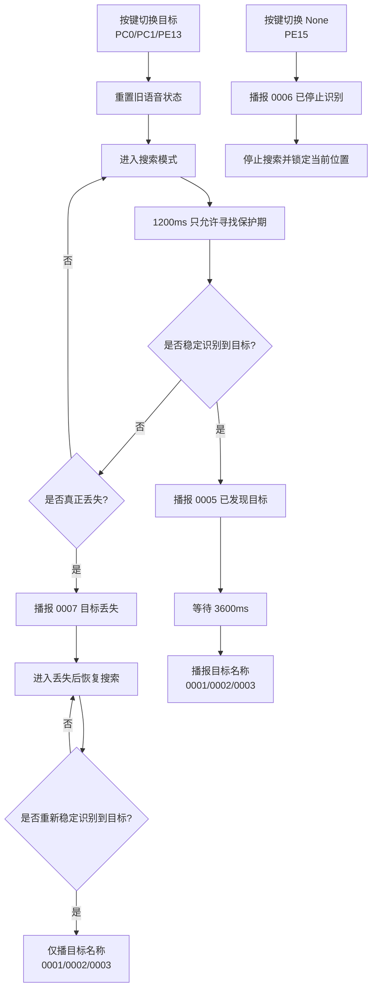

# 语音与状态流转图

本文档对应当前 `main.c` 中已经实现的状态与语音逻辑，方便快速查看整条通路。

## 1. 总体流程图



## 2. 纯文本状态图

```text
                ┌──────────────────────┐
                │ 按键切换 Toilet/Exit/Office │
                └──────────┬───────────┘
                           │
                           v
                ┌──────────────────────┐
                │ 重置旧语音/旧待播状态 │
                └──────────┬───────────┘
                           │
                           v
                ┌──────────────────────┐
                │ 进入搜索模式          │
                │ search_mode = 1       │
                └──────────┬───────────┘
                           │
                           v
                ┌──────────────────────┐
                │ 1200ms 只允许寻找保护期│
                │ 不播“已发现/目标丢失” │
                └──────────┬───────────┘
                           │
                           v
                 ┌────────────────────┐
                 │ 搜索语音 0004 可登记 │
                 │ 正在搜索目标        │
                 └─────────┬──────────┘
                           │
               ┌───────────┴───────────┐
               │                       │
               v                       v
      ┌────────────────┐      ┌──────────────────┐
      │ 稳定识别到目标 │      │ 连续满足丢失条件   │
      └───────┬────────┘      └────────┬─────────┘
              │                         │
              v                         v
   ┌──────────────────────┐  ┌──────────────────────┐
   │ 正常首次发现流程      │  │ 播报 0007 目标丢失   │
   │ 先播 0005            │  │ 进入丢失后恢复流程   │
   └─────────┬────────────┘  └─────────┬────────────┘
             │                           │
             v                           v
   ┌──────────────────────┐  ┌──────────────────────┐
   │ 等待 3600ms          │  │ 恢复搜索，不再播 0004 │
   │ 给“已发现目标”留时间 │  │ 也不再播 0005        │
   └─────────┬────────────┘  └─────────┬────────────┘
             │                           │
             v                           v
   ┌──────────────────────┐  ┌──────────────────────┐
   │ 播 0001/0002/0003    │  │ 重新稳定找到后       │
   │ 厕所在这/出口在这/   │  │ 只播目标名称         │
   │ 办公室在这           │  │ 0001/0002/0003       │
   └──────────────────────┘  └──────────────────────┘


                ┌──────────────────────┐
                │ 按键切换 None (PE15) │
                └──────────┬───────────┘
                           │
                           v
                ┌──────────────────────┐
                │ 播 0006 已停止识别   │
                └──────────┬───────────┘
                           │
                           v
                ┌──────────────────────┐
                │ 停止搜索并锁定当前位置│
                └──────────────────────┘
```

## 3. 各种情况对应表

| 场景 | 当前行为 |
| --- | --- |
| 按下 `PC0` | 切换到厕所目标，进入搜索，不立即播目标名称 |
| 按下 `PC1` | 切换到出口目标，进入搜索，不立即播目标名称 |
| 按下 `PE13` | 切换到办公室目标，进入搜索，不立即播目标名称 |
| 刚切换目标后的 1200ms 内 | 只允许寻找，不播“已发现目标”和“目标丢失” |
| 进入搜索且还没找到 | 可播 `0004`“正在搜索目标” |
| 搜索中稳定识别到目标 | 先播 `0005`，再延时播目标名称 |
| 搜索语音还没播就找到目标 | 取消 `0004`，避免插播 |
| 真正目标丢失 | 播 `0007`“目标丢失” |
| 丢失后重新找到 | 不播 `0004`、不播 `0005`，只播目标名称 |
| 按下 `PE15` | 立即播 `0006`“已停止识别”，停止搜索 |
| 按下 `PE14` | 语音测试：播放/暂停/继续 |

## 4. 当前关键阈值

| 参数 | 当前值 | 作用 |
| --- | --- | --- |
| `VOICE_MODE_SWITCH_SEARCH_ONLY_MS` | `1200ms` | 切换目标后的只寻找保护期 |
| `VOICE_FOUND_CONFIRM_MS` | `700ms` | “已发现目标”的稳定确认时间 |
| `VOICE_TARGET_PROMPT_DELAY_MS` | `3600ms` | “已发现目标”到目标名称的等待时间 |
| `VOICE_LOST_PROMPT_DELAY_MS` | `3200ms` | “目标丢失”语音后的保护时间 |
| `LOST_COUNT_MAX` | `3` | 连续多少次丢失才算真正丢失 |
| `SEARCH_START_DELAY_MS` | `800ms` | 切换/丢失后多久开始左右扫描 |

## 5. 当前 MP3 对照

| 编号 | 内容 |
| --- | --- |
| `0001.mp3` | 厕所在这 |
| `0002.mp3` | 安全出口在这 |
| `0003.mp3` | 办公室在这 |
| `0004.mp3` | 正在搜索目标 |
| `0005.mp3` | 已发现目标 |
| `0006.mp3` | 已停止识别 |
| `0007.mp3` | 目标丢失 |

